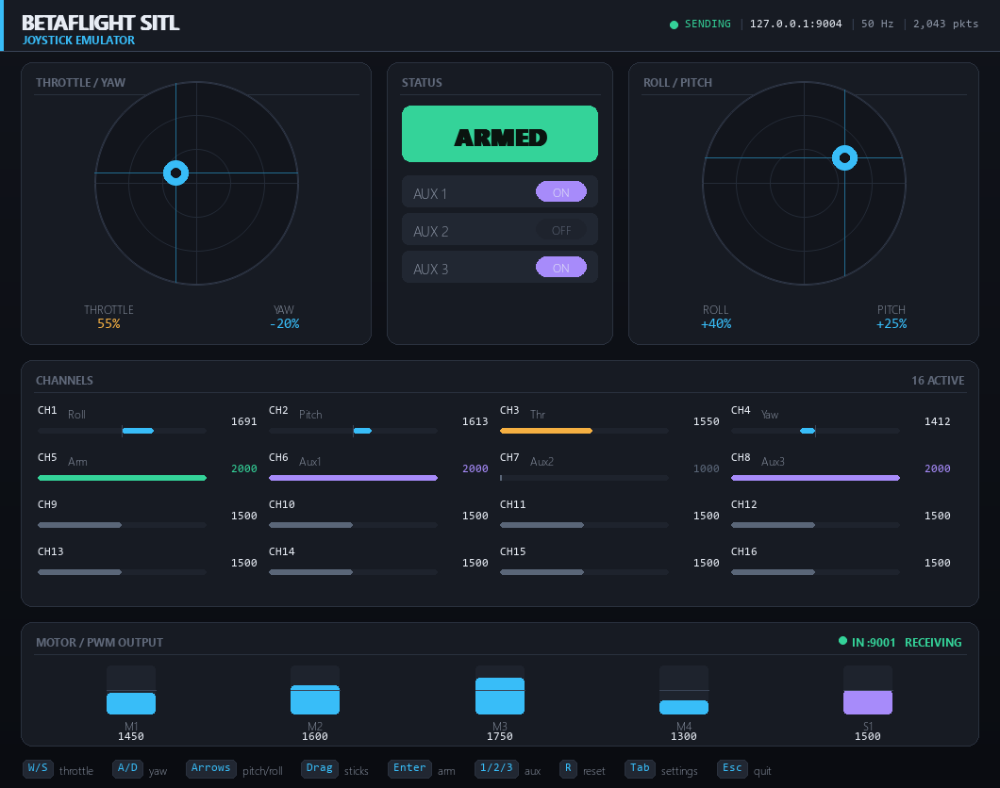

# Betaflight Joystick Emulator

A virtual RC transmitter for [Betaflight](https://betaflight.com/) in two modes:

- **SITL** — UDP RC to Betaflight SITL (`:9004`) and PWM feedback (`:9001`)
- **DEVICE** — Betaflight **MSP** over a WebSocket serial bridge (default
  `ws://127.0.0.1:5761`): `MSP_SET_RAW_RC`, plus motor / servo / status polling

Fly with **mouse** (drag sticks) or **keyboard** (WASD + arrows). All parameters
persist to `config.json`.



## Modes

Switch **Mode** in Settings (`sitl` / `device`) or via `--mode`.

### SITL (UDP)

Betaflight SITL listens for RC on **UDP port 9004**:

```c
typedef struct {
    double   timestamp;      // seconds
    uint16_t channels[16];   // RC values, 1000-2000
} rc_packet;
```

PWM feedback uses `servo_packet_raw` on **UDP 9001** (see Motor panel). When
**Require PWM link** is on, RC is only sent while PWM packets are arriving.

### DEVICE (MSP over WebSocket)

Connects to an MSP-capable WebSocket bridge (raw binary MSP v1 frames, same
byte stream Betaflight Configurator uses over serial). The client negotiates the
WebSocket subprotocol **`binary`** (required by typical serial bridges such as
the one on `ws://127.0.0.1:5761`).

| Direction | MSP command | ID |
|-----------|-------------|----|
| Out | `MSP_SET_RAW_RC` | 200 |
| In (poll) | `MSP_MOTOR` | 104 |
| In (poll) | `MSP_SERVO` | 103 |
| In (poll) | `MSP_STATUS_EX` | 150 |

When **Require MSP link** is on, RC is only sent while the WebSocket is up and
MSP replies arrive (~1.5 s timeout). The Status card shows FC armed from
`MSP_STATUS_EX` when linked; CH5 still drives the override channel.

**Betaflight setup for DEVICE:**

1. In Configurator **Ports**, enable **MSP** on the UART your bridge uses.
2. **Receiver** = **MSP**, or use **MSP Override** with an AUX toggle.
3. Run your serial↔WebSocket bridge so MSP bytes appear on
   `ws://127.0.0.1:5761` (or set **MSP WebSocket URL**).
4. Run the emulator with Mode = `device`.

Disconnect / stop sending → FC RX failsafe applies (your responsibility). `R`
still zeros sticks and AUX locally.

## Requirements

- Python 3.9+
- [pygame](https://www.pygame.org/) and [websocket-client](https://github.com/websocket-client/websocket-client) (see `requirements.txt`)

## Install

```bash
pip install -r requirements.txt
```

On Windows you may need:

```bash
py -m pip install -r requirements.txt
```

## Run

```bash
python joystick_emulator.py
```

DEVICE mode against the default bridge:

```bash
python joystick_emulator.py --mode device --msp-url ws://127.0.0.1:5761
```

| Flag        | Description                              | Default                 |
|-------------|------------------------------------------|-------------------------|
| `--mode`    | `sitl` or `device`                       | from config (`sitl`)    |
| `--ip`      | SITL RC target IP                        | `127.0.0.1`             |
| `--port`    | SITL RC UDP port                         | `9004`                  |
| `--hz`      | RC send rate in Hz                       | `50`                    |
| `--msp-url` | DEVICE MSP WebSocket URL                 | `ws://127.0.0.1:5761`   |
| `--config`  | Path to the settings file                | `./config.json`         |

## Controls

### Sticks

| Input                     | Action                              |
|---------------------------|-------------------------------------|
| `W` / `S`                 | Throttle up / down (holds position) |
| `A` / `D`                 | Yaw left / right (self-centers)     |
| Arrow `Up` / `Down`       | Pitch forward / back (self-centers) |
| Arrow `Left` / `Right`    | Roll left / right (self-centers)    |
| Mouse drag on a gimbal    | Move that stick directly            |

Roll, pitch and yaw spring back to center when released. Throttle stays where
you leave it (configurable via **Sticky throttle**).

### AUX channels (CH5–CH16)

| Type       | Badge | Behavior                                             |
|------------|-------|------------------------------------------------------|
| 2-position | `2P`  | Toggles between AUX low / AUX high                   |
| 3-position | `3P`  | Cycles AUX low → mid (`PWM mid`) → AUX high          |
| Slider     | `SL`  | Any value between AUX low and AUX high (drag it)     |

| Input                    | Action                                             |
|--------------------------|----------------------------------------------------|
| Left-click a channel     | Actuate / set                                      |
| Drag a slider channel    | Continuous value (`SL`)                            |
| Right-click a channel    | Cycle type (`2P` → `3P` → `SL`), saved             |
| `Enter`                  | Actuate CH5 (ARM)                                  |
| `1`…`9`, `0`             | Actuate CH6…CH15                                   |

### Commands

| Key     | Action                                        |
|---------|-----------------------------------------------|
| `R`     | Reset / failsafe (center sticks, cut throttle, disarm all AUX) |
| `Tab`   | Open / close the settings panel               |
| `Esc`   | Quit                                          |

### Arming note

Keep throttle low, press `Enter` to raise CH5, then throttle up. Use `R` as
panic/failsafe.

## Settings panel

| Key                 | Action                                    |
|---------------------|-------------------------------------------|
| `Up` / `Down`       | Select a field                            |
| `Left` / `Right`    | Adjust value (hold `Shift` for coarse step) |
| `Enter`             | Type-edit / cycle Mode; `Enter` confirm, `Esc` cancel |
| `Ctrl`+`S`          | Save to `config.json`                     |
| `D`                 | Reset all settings to defaults            |
| `Tab` / `Esc`       | Close the panel                           |

### Parameters

- **Core (shared)**: `Mode` (`sitl` / `device`), `Send rate (Hz)`
- **Core (SITL)**: `Target IP`, `RC out port`, `PWM in port`, `PWM in enabled`,
  `Require PWM link`
- **Core (DEVICE)**: `MSP WebSocket URL`, `MSP poll (Hz)`, `Require MSP link`
- **PWM range / Stick feel / Throttle / Channels**: same as before (shared).
  Stick feel includes **Key step rate** (initial hold speed), **Key accel**
  (how fast rate ramps while a key is held; `0` = constant), and **Key max rate**
  (ceiling after acceleration).

## Configuration file

Settings are stored in `config.json` next to the script. Every setting is
written on load (migrating older files). Press `Ctrl`+`S` to save. The file is
git-ignored.

## Using with Betaflight SITL

1. Start SITL (`start UDP server for RC input @9004`).
2. Run with Mode = `sitl` (default), target `127.0.0.1:9004`.
3. Map CH5/AUX in Configurator; arm and raise throttle — motor bars should show
   `RECEIVING` from port 9001.

## Using with a real FC (DEVICE)

1. MSP enabled on the UART behind your WebSocket bridge.
2. Receiver = MSP or MSP Override.
3. Bridge listening on `ws://127.0.0.1:5761`.
4. `python joystick_emulator.py --mode device`
5. Header should leave `STANDBY (no MSP)` once replies arrive; sticks drive
   `MSP_SET_RAW_RC`.
